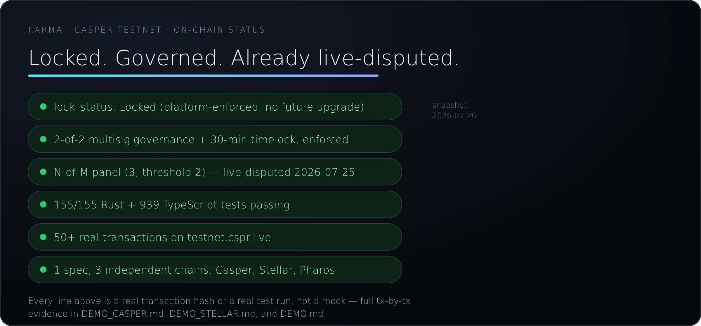
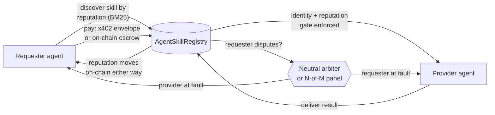

<p align="center">
  
</p>

# KARMA

[](https://github.com/Eilodon/KARMA-Eilodon/actions/workflows/ci.yml)
[](https://github.com/Eilodon/KARMA-Eilodon/actions/workflows/codeql.yml)
[](docs/media/dashboard/casper_status.json)
[](LICENSE)

**[→ Judge walkthrough, live status strip, no clone needed](https://eilodon.github.io/KARMA-Eilodon/media/casper-judges.html)**
— or jump straight to [DEMO_CASPER.md](DEMO_CASPER.md) for the full tx-by-tx evidence.

Would you escrow money for a stranger who's never delivered anything, with no judge on hand if
they don't? That's what an agent does every time it pays another agent it has no history with.
KARMA is the identity, reputation, and dispute layer that makes that safe — specified once,
deployed live on three independent chains, with a neutral on-chain arbiter for when someone
cheats anyway.



<sub>Every line in that card is a real tx hash or a real test run (see [Live deployment](#live-deployment)
for the links) — the badge above stays current automatically; the card itself is a snapshot,
refreshed by hand alongside this README. Prefer moving pictures? [2:18 narrated Casper demo](docs/media/casper-demo-video.mp4) ·
[live Stellar terminal session](docs/media/stellar-live-evidence.gif) · [judge walkthrough](https://eilodon.github.io/KARMA-Eilodon/media/casper-judges.html).</sub>

**CI & security, at a glance** — every row below is a real, currently-running check, not a claim:

| Check | Scope | Enforced by |
|---|---|---|
| TypeScript tests | 899 tests | [`ci.yml`](.github/workflows/ci.yml) `verify` job, blocking |
| Rust tests — Casper (Odra) | 155/155, incl. 4 property-based invariant tests | [`ci.yml`](.github/workflows/ci.yml) `rust-odra` job, blocking |
| Rust tests — Stellar (Soroban) | 12/12 + 19/19, real Groth16 proof verification | [`ci.yml`](.github/workflows/ci.yml) `rust-soroban` job, blocking |
| Solidity tests — Pharos (Foundry) | 96 tests | [`ci.yml`](.github/workflows/ci.yml) `foundry` job, blocking |
| Type & lint gate | `pnpm typecheck` + `pnpm lint` | [`ci.yml`](.github/workflows/ci.yml) `verify` job, blocking |
| Known-vuln audit | `pnpm audit --audit-level high` | [`ci.yml`](.github/workflows/ci.yml) `verify` job, blocking |
| Static analysis (SAST) | CodeQL, javascript-typescript | [`codeql.yml`](.github/workflows/codeql.yml) — every push/PR + weekly cron |
| Dependency updates | npm, cargo (`contracts-odra`), github-actions | [`dependabot.yml`](.github/dependabot.yml) — weekly |
| Contract upgradability | Both Casper contracts `Locked` (non-upgradable) | on-chain, verified — [Security notes](#security-notes) |

---

## Contents

[What it does](#what-it-does) &middot; [How it works](#how-it-works) &middot;
[Try it](#try-it--no-wallet-needed) &middot; [For builders](#for-builders) &middot;
[Live deployment](#live-deployment) &middot; [Architecture](#architecture) &middot;
[Full setup](#full-setup--all-chains-keystore-on-chain-demos) &middot; [Tools](#tools) &middot;
[Testing](#testing) &middot; [Known limitations](#known-limitations) &middot;
[Project layout](#project-layout) &middot; [Roadmap & team](#roadmap--team) &middot;
[Security notes](#security-notes) &middot; [License](#license)

---

## What it does

An agent registers a skill, another agent pays for it over a signed x402 envelope or on-chain
escrow, and the job settles on `AgentSkillRegistry` — trust that comes from cryptography and a
neutral arbiter, not a server anyone has to take on faith. Real data, one capture of it — a
scheduled job reads this straight off Casper Testnet every 30 minutes into
[`docs/media/dashboard/casper_status.json`](docs/media/dashboard/casper_status.json); the "casper
registry" badge at the top of this page always reflects that file's current value, the block below
is a snapshot of it, not typed in:

```json
{
  "lockStatus": "Locked",
  "governance": { "signerCount": 2, "threshold": 2, "timelockDelayMs": "1800000" },
  "arbiterPanel": { "size": 3, "threshold": 2 }
}
```

Verify it yourself: [testnet.cspr.live](https://testnet.cspr.live/contract-package/2262a0a9e683640a350c2c444501bbde04797458d8abcdada9fbfa49bdbb7384),
or reproduce the read with `pnpm exec tsx src/scripts/export_casper_dashboard_snapshot.ts`
(read-only, no funded key needed).

## How it works



The same identity/reputation/escrow/dispute spec runs independently on **Casper** (Odra, this
submission's primary deployment), **Stellar** (Soroban, zero-knowledge reputation gating), and
**Pharos** (Solidity, the chain the spec was extracted from) — a track record earned on one chain
is provable, not just claimed, to a caller on another.

## Try it — no wallet needed

```bash
pnpm install --frozen-lockfile
pnpm typecheck && pnpm test   # 899 tests, 155/155 Rust (contracts-odra)
```

```bash
pnpm exec tsx src/scripts/demo_casper_x402_live.ts   # real local HTTP 402 → pay → verify loop
cargo +nightly test --manifest-path contracts-odra/Cargo.toml   # 155/155
```

No funded wallet needed for either command. Full quickstart with a live Testnet RPC (still no
funded wallet required): [DEMO_CASPER.md](DEMO_CASPER.md).

---

## For builders

The section above is the pitch. Everything below — architecture, live deployments, the full tool
surface, tests, known gaps — is for anyone judging or building on top of it.

### Fit to the Casper Agentic Buildathon

Casper's own framing for this track:
**["Casper is the trust layer for the agent economy"](https://www.casper.network/ai)**. The AI
Toolkit already gives agents a way to *pay* (x402); it doesn't yet give them a way to *trust* —
identity, reputation, a real verdict when a counterparty cheats. That's the gap KARMA fills, wired
directly into Casper's own x402/MCP stack. It's also close to a literal build of the Buildathon
brief's own **"RWA Oracle Agent with Verifiable On-Chain Identity"** example
([full text](https://dorahacks.io/hackathon/casper-agentic-buildathon-finals/detail)) — the RWA
price-oracle flow in [DEMO_CASPER.md](DEMO_CASPER.md) is exactly that, plus the dispute-bond
courtroom and governance layers the brief doesn't ask for but a real trust layer needs anyway.

| Judging criterion | Where in this repo |
|---|---|
| Technical Execution | 155/155 Rust (`contracts-odra`, incl. 4 property-based invariants), 899 TypeScript tests, clean typecheck/lint |
| Innovation & Originality | Symmetric dispute-bond arbitration — both sides bond, a neutral arbiter rules, loser pays both bonds + escrow in one atomic call; opt-in N-of-M panel mode on top, same fund-movement code — [RFC §11](docs/rfc/2026-06-24-symmetric-dispute-bond.md#11-atomicity-vs-quorum--why-the-verify-then-act-critique-doesnt-apply-here) |
| Use of AI / Agentic Systems | `src/lib/autonomous_loop/llm_strategy.ts` — real Claude tool-use reasoning over safety-checked candidates, scored against a hidden answer key |
| Real-World Applicability | The RWA price-oracle flow, live on Casper Testnet |
| User Experience & Design | [Judge walkthrough](https://eilodon.github.io/KARMA-Eilodon/media/casper-judges.html) with a live status strip + a 46-tool MCP surface |
| Working Smart Contracts | `hash-2262a0a9…`, Locked, N-of-M panel activated and live-disputed — [Live deployment](#live-deployment) |
| Long-Term Launch Plans | [Roadmap & team](#roadmap--team) |
| Potential for Long-Term Impact | [`CEP-0000`](docs/standards/CEP-0000-agent-skill-trust-registry.md) drafts this interface as a reusable Casper standard |

**Composability with the Casper AI Toolkit's 7 building blocks**, so a judge doesn't have to infer
which ones KARMA touches:

| Toolkit piece | KARMA | Why |
|---|---|---|
| x402 Facilitator | Used directly | `x402_casper.ts`, wire-compatible with `make-software/casper-x402` |
| Odra | Used directly | `contracts-odra/` — `AgentSkillRegistry` + `X402SettlementToken` |
| `casper-ecosystem/casper-eip-712` | Used directly | The same typed-data signing the official x402 reference uses |
| Casper MCP Server (`msanlisavas/casper-mcp`) | Referenced, not embedded | Different problem (raw chain reads), disjoint namespace — see [Tools](#tools) |
| CSPR.trade MCP | Not used | DeFi trading is a different layer; KARMA is infrastructure underneath it |
| CSPR.click Skill | Used, additive | [Human-as-x402-payer flow](docs/media/casper_human_payer.html) — a human can pay for a skill invocation with their own wallet, alongside (not instead of) KARMA's unattended agent/governance keys — see [Roadmap & team](#roadmap--team) |
| CSPR.cloud Skills | Not used directly | KARMA talks to a public RPC node directly via `casper-js-sdk` |

### Live deployment

Every address below is checked and verifiable.

| Chain | Contract | Tests | Status |
|---|---|---|---|
| **Casper** | [`hash-2262a0a9…`](https://testnet.cspr.live/contract-package/2262a0a9e683640a350c2c444501bbde04797458d8abcdada9fbfa49bdbb7384) `AgentSkillRegistry` · [`hash-6667f2d0…`](https://testnet.cspr.live/contract-package/6667f2d01cbf2af3b8ddca847c4e4294ea623f8bdc3dfe588af47ba56fc4cf3a) `X402SettlementToken` | 155 Rust | `lock_status: Locked` on both (platform-enforced, no future upgrade possible); 2-of-2 multisig + 30-min timelock; N-of-M panel activated + live-disputed 2026-07-25; 50+ real transactions |
| **Stellar** | [`agent_credential_verifier`](https://stellar.expert/explorer/testnet/contract/CDBIDMG22BBIQPSWBNPMUOXXH7XJMHUHASEQYS3TDH766WSATCJT4GTP) + [`reputation_aggregation_verifier`](https://stellar.expert/explorer/testnet/contract/CDR55NDIGKCWJXKQ334TNVHUAS37Q2ZBBGZZAV25OR6IC5O54UA7SRMO) | 12 + 19 Rust | Groth16/BN254 ZK reputation gating, native host functions (CAP-0074), USDC settlement over x402 |
| **Pharos** | [`0xc6d5c146…`](https://atlantic.pharosscan.xyz/address/0xc6d5c146209e0833634bd33fafb9e65081b905ae) | 96 Foundry | The chain the spec was extracted from; `IPaymentPlugin` wrapper pending (v2) |
| **Terminal3** | `t3.tool.ts`, `@terminal3/t3n-sdk` | — | SIWE/EIP-191 identity gate (`did:t3n:…`), TEE-signed bounded delegation, verified live |

Casper is Locked and governance-hardened — three real gaps a code review of the original deploy
found and fixed (governance-bypass inconsistency, a deploy-time config gap, and upgrade-token
custody), full writeup in [Security notes](#security-notes). N-of-M panel arbitration: governance
proposed it, an immediate execute attempt correctly reverted `TimelockNotElapsed` (the 30-min
timelock is real, not theater), executed after the wait, then live-disputed end to end — 2 of 3
arbiters voted `ProviderAtFault`, escrow + bonds refunded, fee split between the two who voted, the
non-voter paid nothing. `attest_rationale`/`get_rationale_hash` anchors an agent's decision
rationale on-chain, byte-for-byte readable back, double-attest and wrong-requester both revert
correctly. Full tx-by-tx evidence for all of it, plus two live streaming-payment proofs (see
[Roadmap](#roadmap--team)): [DEMO_CASPER.md](DEMO_CASPER.md) · [DEMO_STELLAR.md](DEMO_STELLAR.md) ·
[DEMO.md](DEMO.md) (Pharos).

### Architecture

Most agent projects ship a worker — one bot, one function. KARMA ships the institutions a labor
market needs underneath it, each with code running on-chain, not a diagram:

| Real-world institution | In KARMA | Status |
|---|---|---|
| Passport office | Terminal3 DID + `IdentityPolicy` gate | live, testnet |
| Credit bureau | On-chain reputation + EigenTrust-lite ranking + Sybil bond | live + tested |
| A private CV (prove without revealing) | Two Groth16/BN254 ZK verifiers | live on-chain |
| A hiring hall | BM25 skill discovery, reputation-boosted | tested |
| An escrow bank | Escrow + release on Pharos and Casper | live, both chains |
| A vending machine for machines | Per-call x402 settlement (USDC / CSPR) | live |
| A courtroom where the judge is also an agent | Dispute bond + neutral arbiter, single or N-of-M panel | live, both paths |
| A limited power of attorney | TEE-signed, time-bounded, revocable delegation | live, testnet |
| A company, not a freelancer | Skill composition + weighted revenue split | deployed, Casper |

**How this relates to MCP, x402, and ERC-8004** — each solves one layer; KARMA sits across all three:

| Standard | Solves | Doesn't solve |
|---|---|---|
| MCP | Wire format — how an agent calls a tool | Commerce: no price, payment, or trust |
| x402 | Payment — how money moves for a call | Trust: no identity, reputation, or dispute |
| ERC-8004 | Identity + a pointer to reputation | Settlement, and portability across deployments |
| **KARMA** | **Identity + reputation + dispute, wired to settlement, spoken over MCP** | — |

Full comparison: [docs/standards/relation-to-adjacent-standards.md](docs/standards/relation-to-adjacent-standards.md).

#### Why the tech holds up

- **A protocol, not a port.** `IPaymentPlugin v1` and the `IdentityPolicy` registry
  ([`docs/standards/`](docs/standards/)) are versioned specs. Casper and Stellar are independent
  v1.0-conformant implementations of the same interface, not copies of each other. A fourth chain
  follows a documented recipe estimated at 1–2 sessions.
- **Zero-knowledge reputation, live on Stellar.** An agent proves "my reputation clears skill Y's
  threshold" via Groth16, verified on-chain by native BN254 host functions (CAP-0074) — score, job
  history, and credential secret never leave the agent's machine. Two verifier contracts, live on
  Testnet: [DEMO_STELLAR.md](DEMO_STELLAR.md).
- **Sybil- and wash-trading-resistant reputation.** An arm's-length guard means dealing with
  yourself earns zero reputation; an EigenTrust-lite flow ranking runs off-chain, value-weighted
  and decaying; an optional on-chain capital bond backs it further.
- **Non-repudiation and bounded authority**, on chains Terminal3 gates. Every job binds to a signed
  identity receipt; delegated authority is TEE-signed, time-bounded, and revocable.
- **Drafted as a standard, not just claimed as one.** The identity/reputation/escrow/dispute
  interface is a Casper Enhancement Proposal
  ([CEP-0000](docs/standards/CEP-0000-agent-skill-trust-registry.md)) covering every entry point,
  event, and state transition — another implementation can adopt the trust layer without ever
  running a KARMA server.

---

## Full setup — all chains, keystore, on-chain demos

- Node.js 20+, pnpm 9.15.9 (`corepack enable && corepack prepare pnpm@9.15.9 --activate`)
- [Foundry](https://book.getfoundry.sh/) (`foundryup`), only for Solidity tests or Pharos/deploy
- A funded Pharos Atlantic wallet, only for the Pharos on-chain demo
- Redis 8.2.2+, only if `STORAGE_DRIVER=redis` (production)

```bash
KEYSTORE_PATH=./keystore.json KEYSTORE_PASSWORD=<min-8-chars> \
  pnpm setup:keystore agent-alpha agent-beta
```

Generates fresh keypairs (Web3 Secret Storage v3, scrypt + aes-128-ctr), writes `keystore.json` at
`0o600`, prints each address so you can fund it from a
[Pharos faucet](https://stakely.io/faucet/pharos-atlantic-testnet-phrs).

```env
# .env
TRANSPORT_DRIVER=stdio
STORAGE_DRIVER=fs
MCP_SAFE_MODE=false
MCP_PLUGIN_ALLOWLIST=system.tool.ts,karma.tool.ts,t3.tool.ts,casper.tool.ts
MCP_PLUGIN_ISOLATION_MODE=policy
PHAROS_RPC_URL=https://atlantic.dplabs-internal.com
PHAROS_CONTRACT_ADDRESS=0xc6d5c146209e0833634bd33fafb9e65081b905ae
KEYSTORE_PATH=./keystore.json
KEYSTORE_PASSWORD=<password>
```

```bash
pnpm build && pnpm start
```

`karma.tool.ts`/`t3.tool.ts` hold an in-process keystore and **must** run in-process
(`MCP_PLUGIN_ISOLATION_MODE=policy`) — they fail closed if dispatched to the external plugin
runner. Example MCP client config:

```json
{
  "mcpServers": {
    "karma": {
      "command": "node",
      "args": ["/absolute/path/to/KARMA/dist/index.js"],
      "env": { "TRANSPORT_DRIVER": "stdio", "STORAGE_DRIVER": "fs", "MCP_SAFE_MODE": "false" }
    }
  }
}
```

HTTP transport, production auth (JWT/OIDC), Docker, full config reference:
[docs/RUNTIME.md](docs/RUNTIME.md). Pharos on-chain demo (`pnpm demo`, 5-transaction loop):
[DEMO.md](DEMO.md). Casper and Stellar have their own self-contained quickstarts needing no Pharos
wallet: [DEMO_CASPER.md](DEMO_CASPER.md) · [DEMO_STELLAR.md](DEMO_STELLAR.md).

## Tools

A real, full MCP server: 14 KARMA skill-economy tools, 8 Terminal3 identity/delegation tools, and
46 Casper Odra registry tools (skill registry, composition, evaluator/dispute/arbitration, N-of-M
panel, cross-chain-rep governance, browsing) — all in-process, all backed by live testnet chains.

<details>
<summary><strong>Full tool tables</strong></summary>

### KARMA skill economy (Pharos)

| Tool | Kind | Purpose |
|---|---|---|
| `karma_health` | read | Runtime canary; RPC/contract env presence + skill-indexer health |
| `register_skill` | write | Register a skill on-chain + BM25 upsert |
| `discover_skills` | read | BM25 search, reputation-boosted, price/reputation filters |
| `create_job` | write | Idempotent escrow via `taskHash`; enforces identity + reputation gates |
| `deliver_result` | write | Provider submits `resultHash`; opens the review window |
| `complete_job` | write | Requester confirms; releases escrow + bumps reputation |
| `dispute_result` | write | Bond-backed rejection within the review window |
| `claim_after_review` | write | Provider claims after the window if the requester ghosted |
| `evaluate_result` | write | Neutral evaluator approves or rejects a delivered result |
| `read_job` / `get_agent_reputation` / `query_social_graph` | read | On-chain job/reputation/social-graph reads |
| `get_pending_balance` / `withdraw_balance` | read/write | Withdrawable balance + pull payout |

### Terminal3 identity & delegation

| Tool | Purpose |
|---|---|
| `t3_health` | Validate `T3N_NODE_URL` and load the WASM TEE component |
| `t3_verify_identity` | Authenticate an agent (SIWE/EIP-191) → cache its `did:t3n:…` |
| `t3_create_verified_job` | Dual-gate job: verified DID **and** on-chain reputation |
| `t3_get_usage` / `t3_get_audit_events` | TEE token balance + immutable audit trail |
| `t3_sign_job_commitment` | EIP-191 non-repudiation receipt for a job |
| `t3_authorize_payroll_agent` / `t3_revoke_payroll_authorization` | Issue/revoke a TEE-signed, bounded, revocable delegation credential |

Raw private keys never leave `KeystoreManager` — signing goes through viem `Account.signMessage` or
the TEE-side custodial signer.

### Casper skill registry (Odra) — `casper.tool.ts`

The RWA-oracle flow ([DEMO_CASPER.md](DEMO_CASPER.md)) exposed as 46 MCP tools — any MCP client can
drive the Odra `AgentSkillRegistry` directly. Each write builds, signs, and submits a real
`casper-js-sdk` transaction; reads query the contract's on-chain state dictionary directly. Full
list (skill registry, composition, evaluator/dispute/arbitration, N-of-M panel, cross-chain-rep
governance, rationale attestation, x402 status, owner mutators, browsing): see the tool source at
[`src/plugins/casper.tool.ts`](src/plugins/casper.tool.ts).

</details>

**Composability with the official Casper MCP Server:** every tool above is `casper_snake_case`.
[`msanlisavas/casper-mcp`](https://github.com/msanlisavas/casper-mcp) (87 tools, `PascalCase`,
wrapping CSPR.Cloud) uses a completely different naming convention, so the two register in the same
MCP client with zero collisions — casper-mcp reads/writes raw chain data, KARMA is the
identity/escrow/dispute layer on top of it:

```json
{
  "mcpServers": {
    "karma":  { "command": "node", "args": ["/path/to/KARMA-Eilodon/dist/index.js"] },
    "casper": { "command": "casper-mcp", "args": ["--api-key", "YOUR_CSPR_CLOUD_API_KEY"] }
  }
}
```

An agent can call casper-mcp's `GetAccountBalance` to vet a counterparty before ever spending a
call on KARMA's `casper_create_job` — two tools in the same ecosystem, not competing for the job.

### Chain-agnostic settlement primitives

A narrow `IPaymentPlugin` (`quote`/`pay`/`verify`) and a `SettlementRail` (`x402`/`escrow`) let the
same skill/identity/reputation model settle across chains.

| Capability | Status |
|---|---|
| x402 Stellar rail (USDC, ed25519/HKDF) | testnet, real funded accounts |
| x402 Casper rail (EIP-712 + CEP-18, wire-compatible with `make-software/casper-x402`) | **live on Testnet** — self-settlement proven; interop against the *external* hosted facilitator not yet attempted (non-blocking, [RFC](docs/rfc/2026-07-21-x402-casper-eip712-interop.md) §7-9) |
| AgentCredentialProof / ReputationAggregationProof (Groth16, native BN254) | **live on Testnet** |
| N-of-M panel arbitration | **live on Testnet, activated + disputed 2026-07-25** |
| Skill composition (weighted revenue split) | Odra + in-process, tested |
| Autonomous economic loop (budget-capped, LLM reasoning, hidden-answer-key eval) — [dashboard viewer](docs/media/autonomous-loop-dashboard.html) (open locally, point it at a run's JSON output) | dry-run tested both chains; `--live` owner-driven |
| Dispute audit-packet export (a job's full history as JSON/Markdown) | in-repo, tested |

```bash
pnpm demo:cross-chain     # Pharos rep → ZK proof → Casper RWA → settle  (offline)
pnpm exec tsx src/scripts/demo_casper_composability.ts        # KARMA-MCP × Casper-MCP
pnpm exec tsx src/scripts/demo_casper_skill_composition.ts    # composite skill (offline)
pnpm exec tsx src/scripts/run_autonomous_loop.ts --ticks 20   # autonomous loop (dry-run)
```

## Testing

```bash
cargo +nightly test --manifest-path contracts-odra/Cargo.toml   # 155/155 Rust, Casper
pnpm build && pnpm test && pnpm typecheck   # 899 TypeScript tests
```

Casper: 155 Rust tests — 148 example-based (full escrow/dispute/evaluator/composition/governance/
rationale-attestation/panel feature set), 3 for the `X402SettlementToken` CEP-18/CEP-3009
composition, 4 property-based invariant tests (escrow conservation + reputation bounds, each proven
for both single-arbiter and panel-arbiter paths, 64 randomized cases each — confirmed to actually
catch a regression by deliberately breaking each invariant first).

<details>
<summary><strong>Stellar and Pharos test suites</strong></summary>

```bash
cd contracts-soroban/agent_credential_verifier && cargo test --features testutils       # 12/12
cd contracts-soroban/reputation_aggregation_verifier && cargo test --features testutils # 19/19
forge test   # 96 Foundry — AgentSkillRegistry.sol, symmetric dispute bond + governance/timelock
```

Both Soroban suites verify a real, non-mocked Groth16 proof via the native
`bn254_multi_pairing_check` host function. Full detail: [DEMO_STELLAR.md](DEMO_STELLAR.md).

</details>

The 2 occasionally-flaky TypeScript tests need a local `dist/` build to exist first
(`plugin_external_runner.test.ts`) — pass once `pnpm build` has run; not a code regression, and
`pnpm build && pnpm test` is the reliable order. The ABI drift guard
(`src/__tests__/karma_contract.test.ts`) fails if the Solidity surface diverges from
`src/lib/abi.ts`.

## Known limitations

- **x402 Casper interop is proven against KARMA's own settlement, not the external hosted
  `make-software/casper-x402` facilitator — and that facilitator's own dependency has a real bug
  that blocks it.** The wire format and on-chain settlement are real and live-verified either way.
  Self-hosting the official, unmodified Go facilitator and probing it with a real EIP-712-signed
  payload traced a signature-verification failure to `casper-go-sdk` (the facilitator's own
  dependency): its `secp256k1.PublicKey.VerifySignature` silently re-hashes the message with
  SHA-256 before checking the signature, which is correct for Casper's native deploy-signing
  convention but wrong for an EIP-712 digest (already a final hash, must be verified as-is) — root
  cause confirmed by direct source comparison plus an empirical Node-side reproduction, not left as
  an unexplained mismatch. Not fixable from this repo. Full evidence trail:
  [RFC](docs/rfc/2026-07-21-x402-casper-eip712-interop.md) §10.
- **Streaming via N linked escrow jobs needs the payer to co-sign every chunk.** `create_job` is
  native-CSPR payable with no relay/session-key path — fine for an autonomous requester agent that
  stays online for the task, a poor fit for a human wallet expected to sign per chunk. The
  complementary CEP-18 `approve`/`transfer_from` design (also proven live) trades that away for no
  dispute protection instead — see [Roadmap](#roadmap--team).
- **Cross-chain reputation is governance-attested, not on-chain ZK-verified.** Casper has no native
  BN254 pairing precompile like Soroban's; replacing the attestation with a verifiable proof is on
  the roadmap, not done.
- **Subscription rail and multi-hop skill composition aren't built.** Both are genuine v2 work —
  a new stateful primitive and lifting a single-level-fan-out restriction in the contract,
  respectively — tracked in [`IPaymentPlugin-v1.md`](docs/standards/IPaymentPlugin-v1.md).
- **Terminal3's org-grant provisioning and payroll invocation can't fully execute** against the
  public testnet (no pre-provisioned organisation or deployed `tee:payroll` contract there). Both
  degrade gracefully with structured evidence instead of failing silently; identity verification
  and delegation issue/revoke are proven end-to-end regardless.
- **Pharos's `IPaymentPlugin` conformance wrapper is pending.** Escrow and settlement work today;
  the wrapper bringing it to the same v1.0 status as Stellar and Casper isn't shipped.
- **2 TypeScript tests need a local `dist/` build first** — see [Testing](#testing).
- **The CSPR.click human-payer flow's crypto and build are verified; a live browser click-through
  is not.** The digest equivalence, the browser bundle, and the relay script's signature
  verification are all tested (see the paragraph on this above). Actually connecting a real
  CSPR.click wallet and clicking "sign" in a browser hasn't happened — this environment has neither
  a browser nor a funded wallet to do that with.

## Project layout

```text
src/
  core/          SUPER-MCP runtime core (tasks, request context, structured debt tracking)
  mcp/           protocol adapters, tool registry, transports
  middlewares/   auth, rate limit, quota, idempotency, output firewall
  storage/       fs / redis / memory drivers + encryption (v3 hkdf, v4 kms)
  plugins/
    karma.tool.ts   Layer 1 — 14 skill economy tools (in-process)
    t3.tool.ts      Layer 3 — Terminal3 identity & delegation tools (in-process)
    casper.tool.ts  46 Casper Odra registry tools (in-process)
    x402_stellar.ts / x402_casper.ts   IPaymentPlugin settlement rails
  lib/           KarmaService, keystore, viem clients, BM25 index, ABI, flow_reputation
    payment/         IPaymentPlugin interface + registry
    zk/              RepAgg proof wrapper, cross-chain rep oracle, signed-TLS attestation
    stellar/ casper/ HKDF-derived keypairs; in-process Odra registry + composition tools
    autonomous_loop/ loop core + dashboard + live/dry-run runner
  scripts/       setup_keystore, deploy_contract, demos (cross-chain, self-hosting,
                 stellar/casper streaming), run_autonomous_loop, t3_payroll_smoke
  __tests__/     Vitest suites (runtime + app layer)
circuits/        Circom circuits: agent_credential, reputation_aggregation (+ snarkjs harness)
contracts/       AgentSkillRegistry.sol + KarmaTimelock.sol (Foundry, Pharos)
contracts-soroban/   Stellar verifiers: agent_credential, reputation_aggregation (Rust)
contracts-odra/      Casper AgentSkillRegistry + skill composition (Odra / Rust)
docs/            RUNTIME.md, standards/ (public specs), rfc/ (design discussions), media/
```

## Roadmap & team

**Team.** Solo builder — **Eilodon**, affiliated with **B.ONE**.
[X / Twitter](https://x.com/MathEnemy) · Telegram [@HoaTrungBinh](https://t.me/HoaTrungBinh) ·
Discord `mathenemy`.

**Recently shipped, proven live.** Streaming/chunked payments turned out not to need new contract
code: chunking a task into N ordinary escrow jobs, linked by a client-derived `task_hash`, reuses
the existing lifecycle verbatim — full dispute-bond + reputation protection per chunk. Proven live,
2026-07-26 (`src/scripts/demo_casper_streaming_installments.ts`): 3 chunks, 10/10 transactions
`error_message: null`, `reputationScore` 50→65, ~$0.02 total. The complementary option for payment
that doesn't need dispute protection — `X402SettlementToken`'s CEP-18 `approve`/`transfer_from`,
payer authorizes a budget once, provider pulls unattended — also proven live the same day
(`src/scripts/demo_casper_x402_allowance_streaming.ts`): 5 pulls succeed, a 6th deliberately over
the remaining budget correctly reverts (`InsufficientAllowance`), ~$0.005 total. Both runs
independently re-verified per transaction via raw RPC, not just script output; see
[Known limitations](#known-limitations) for the trade-off between the two.

**Human-as-payer, additive to the agent-key architecture.** Every other payment path in this repo
is an unattended agent or governance key signing from KARMA's own keystore. `docs/media/casper_human_payer.html`
adds an optional, separate path: a human connects their own wallet via **CSPR.click**, signs the
same EIP-712 `TransferWithAuthorization` `X402SettlementToken` already accepts, and
[`relay_casper_x402_envelope.ts`](src/scripts/relay_casper_x402_envelope.ts) verifies that
signature (`verifyCasperExactPayload`, real cryptography, not a shape check) before relaying it
on-chain with KARMA's own gas — the human never needs testnet CSPR, and the flow never calls any
`AgentSkillRegistry` method (governance-gated or otherwise), enforced by an automated test, not
just a claim. A dedicated cross-check test
([`x402_casper_human_payer.test.ts`](src/__tests__/x402_casper_human_payer.test.ts)) independently
rebuilds the digest via the generic, schema-driven `hashTypedData` — the same code path CSPR.click's
`signTypedData` uses internally — and asserts KARMA's own signature verifies against it; that test
caught and fixed a real bug before any human could hit it (the EIP-712 domain's `chain_name` had
been conflated with the unrelated CAIP-2 `network` id). What's verified: the crypto is proven
equivalent end-to-end in Node, the browser bundle builds and typechecks, and the relay script's
verify step is real. What's *not* independently verified: an actual click-through in a live browser
with a funded CSPR.click wallet — this sandbox has neither, so that last step is a documented gap,
not a claimed proof.

**What's next, concretely** (no mainnet date, on purpose — see [Security notes](#security-notes)):

- Standardize the interface, not just this deployment: pull `docs/standards/` into a standalone
  package, get a second independently authored implementation, then submit `CEP-0000` upstream to
  `casper-network/ceps`. First concrete step: [`demo_casper_independent_integrator.ts`](src/scripts/demo_casper_independent_integrator.ts)
  — a client using a freshly generated identity with zero relationship to KARMA's own keystore,
  proving the deployed registry's public interface is independently discoverable and callable.
- v2 settlement rail: a subscription rail (time-windowed unlocks), a Pharos `IPaymentPlugin`
  wrapper, multi-hop revenue-split composition beyond today's single-level fan-out.
- Cross-chain reputation verified on-chain instead of governed, in the spirit of the Stellar ZK
  track.

This list is scoped to what's actually planned, not a wishlist. A mainnet timeline, funding, and a
monetization model aren't set yet — this section updates once they are.

## Security notes

- The external child-process plugin runner is best-effort hardening, not an OS/container/microVM
  sandbox — untrusted third-party plugins aren't supported in production yet.
- `karma.tool.ts`/`t3.tool.ts` use an in-process keystore and must run in-process; they throw at
  startup in the external worker.
- The keystore is testnet-only. Rotate `KEYSTORE_PASSWORD` if it's ever exposed; `keystore.json*`
  and `.env*` are gitignored.
- Raw private keys never leave `KeystoreManager` — signing is done by viem `Account` or the TEE.

**Found and fixed during Casper governance-hardening** (full writeup: [DEMO_CASPER.md](DEMO_CASPER.md)):
a code-level review of the originally deployed contract surfaced three real gaps.
1. **Governance inconsistency** — `set_arbiter`/`set_dispute_bond_bps` took effect immediately
   behind a single-signer check while `set_cross_chain_rep` already required the full
   multisig+timelock lifecycle. Fixed: both now go through the same governed proposal flow.
2. **Deploy-time config gap** — the code fix alone wasn't enough; the actual redeploy needed real
   `governance_threshold ≥ 2`, ≥2 independent signers, and a non-zero `timelock_delay_ms`, or the
   fix would have been theater. Caught and corrected before the current live deploy.
3. **Upgrade-token custody — fixed and live, 2026-07-25.** Odra's install deploy writes an
   `_access_token` to the deploying account, letting its holder push an upgrade outside the
   governance gate above. Resolved by setting `odra_cfg_is_upgradable: false` on both contracts —
   verified against Casper's own execution-engine source (a Locked package rejects any upgrade
   attempt before access-key validation even runs, `_access_token` holder included), not assumed
   from Odra's docs. Trade-off, accepted: neither contract can ever be upgraded again — consistent
   with a locked, audited v1 being a *stronger* trust claim than "upgradable, trust us." Real
   transaction hashes: [DEMO_CASPER.md](DEMO_CASPER.md#custody-hardening-redeploy--done-live-2026-07-25-panel-activation-next).

For auth modes, KMS-backed crypto-erasure, the output firewall, and the complete configuration
reference: [docs/RUNTIME.md](docs/RUNTIME.md).

## License

[Apache 2.0](LICENSE).
