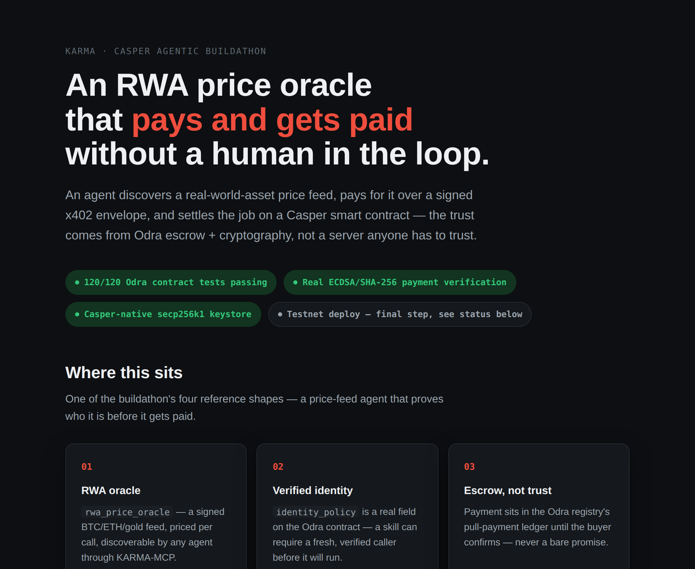
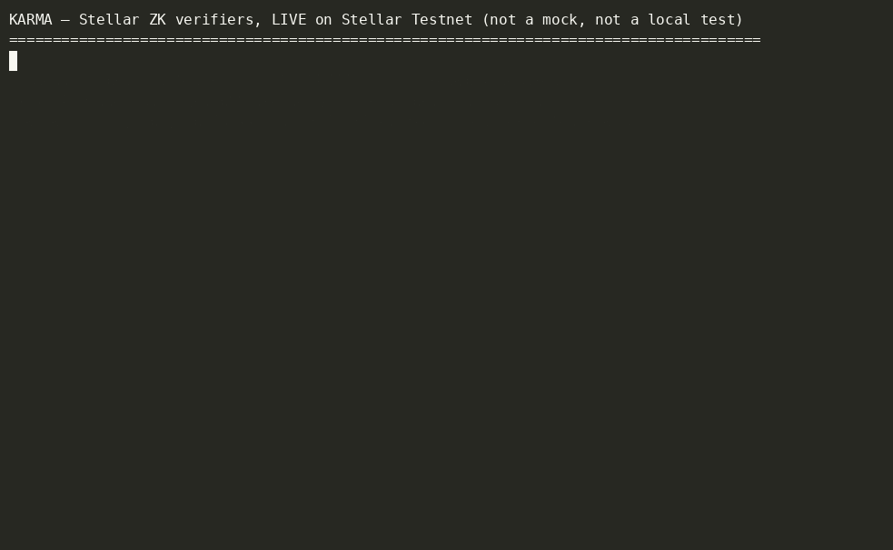

# KARMA

> 🤖 **Casper Agentic Buildathon — judges start here:** [DEMO_CASPER.md](DEMO_CASPER.md) ·
> [90-second visual walkthrough (live page, no clone needed)](https://eilodon.github.io/KARMA-Eilodon/media/casper-judges.html) ·
> an RWA price-oracle agent that discovers a skill, pays for it over a real signed x402 envelope,
> and settles the job on an Odra `AgentSkillRegistry` — trust from escrow + cryptography, not a
> server anyone has to take on faith.
>
> [](https://eilodon.github.io/KARMA-Eilodon/media/casper-judges.html)
>
> ☝️ **The terminal panels in that page are a real captured run**, not typed-out copy — reproduce
> them yourself with `pnpm exec tsx src/scripts/demo_casper_x402_live.ts` (real local HTTP 402 →
> pay → verify loop), `cargo +nightly test --manifest-path contracts-odra/Cargo.toml` (120/120),
> and `contracts-odra/build-wasm.sh` (a real, `WebAssembly.validate()`-clean ~538KB
> `karma_odra.wasm`, all 59 entry points exported). **The contract is deployed and verified
> end-to-end on Testnet** (`hash-29b7daeb…`, governance-hardened redeploy) — see
> [DEMO_CASPER.md](DEMO_CASPER.md) for the exact tx-by-tx evidence. Governance is a real 2-of-2
> multisig with a 48h timelock, confirmed live by decoding the contract's own
> `GovernanceConfigured` event, not just trusting the deploy args as submitted.
>
> **Four more live flows closed out same-day, all real transactions on that contract, all in
> [DEMO_CASPER.md](DEMO_CASPER.md):** a full job lifecycle (register → bond → escrow → deliver →
> confirm → withdraw, provider reputation bumped `→ 55` on-chain); the **courtroom pillar run for
> real** — a requester disputes a delivered result, the provider matches the bond to contest, and a
> neutral on-chain arbiter (a distinct account from both parties) rules `ProviderAtFault` —
> reputation *actually slashed* `50 → 40`, escrow *actually refunded*, not a unit test; a real
> `propose_set_cross_chain_rep` → `approve_proposal` chain for the "reputation travels with the
> agent, not the chain" story, with `execute_proposal` correctly reverting `TimelockNotElapsed`
> against the real 48h clock; and, in the spirit of "prove it, don't just claim it," the write-up
> doesn't hide the two real mistakes hit live (an underfunded throwaway key, a duplicate task
> hash) — including the exact error codes that caught them.
>
> 🎬 **[Watch the ~2:18 narrated video](docs/media/casper-demo-video.mp4)** — the economic loop,
> the courtroom ruling live, and the governed cross-chain-rep timelock rejecting an early execute —
> all captured from real terminal runs against the live contract, all real tx hashes, real
> `testnet.cspr.live` screenshots, no typed-out copy.

> **Proof this is a protocol, not a single-chain app:** the same identity/reputation/settlement
> model that's live on Casper above also runs on **Stellar** — a Groth16/BN254 zero-knowledge
> reputation gate, verified on-chain via Soroban's native host functions (CAP-0074), settling
> per-call in USDC over x402. Architecture, live contract addresses, and the captured terminal
> evidence are in [Zero-knowledge reputation gating](#architecture-zero-knowledge-reputation-gating-proven-on-stellar)
> below; full write-up in [DEMO_STELLAR.md](DEMO_STELLAR.md).

> **What's new for this Buildathon, and what predates it** — stated up front rather than left for
> a judge to dig out. KARMA's protocol core (the identity/reputation/escrow/dispute spec, the
> MCP runtime under `src/core`, `src/mcp`, `src/middlewares`) and the Pharos and Stellar
> implementations predate the Casper track. **Everything Casper-specific was built new for this
> Buildathon and lives entirely in this submission window:** the Odra `AgentSkillRegistry`
> (`contracts-odra/`, 120 Rust tests), the Casper secp256k1 keystore adapter, the `x402_casper.ts`
> payment rail, `live_client.ts`'s real `casper-js-sdk` transaction building, the 26-tool
> `casper.tool.ts` MCP surface, the governance-hardened redeploy, and every live transaction
> recorded in [DEMO_CASPER.md](DEMO_CASPER.md). The same standard we'd apply to any other
> submission: a pre-existing base is fine to disclose, not fine to hide — the Casper-conformant
> implementation, the part this Buildathon actually judges, is original and shipped now.

> A protocol for agent economies — not a single-chain app. Agents publish skills, get discovered
> by relevance and reputation, and invoke each other under enforceable trust gates: identity,
> reputation, and settlement, specified once and implemented per chain. Built on **SUPER-MCP**
> (Layer 0, bundled here under `src/core`, `src/mcp`, `src/middlewares`, `src/storage`) — a
> hardened TypeScript/ESM MCP server.

**KARMA is a spec with reference implementations, not a spec with one implementation.**
[`docs/standards/`](docs/standards/) defines `IPaymentPlugin v1` (a 3-method settlement
interface — `quote` / `pay` / `verify`) and a public, PR-governed `IdentityPolicy` registry.
**Casper is a v1.0 ✓ conformant** implementation of that interface — governance-hardened,
deployed and verified end-to-end on Testnet (see [Live deployment](#live-deployment) and
[DEMO_CASPER.md](DEMO_CASPER.md)) — and so is Stellar (see
[reference-implementations.md](docs/standards/reference-implementations.md)); Pharos is the
original chain the spec was extracted from. The documented playbook for landing a new chain
adapter is estimated at **1–2 sessions** — not months. That's the actual bet here: this isn't
"KARMA also runs on your chain," it's "your chain becomes a conformant node in a protocol that
already runs on others" — and Casper's is the deployment every later adopter in this ecosystem
has to interoperate with.

**On Casper, that implementation is the deepest one we've shipped.** Identity gate, reputation,
escrow, symmetric-bond dispute arbitration with a neutral on-chain arbiter, multisig+timelock
governance, and weighted skill composition — all live on Testnet, 120 Rust tests, real
transactions end-to-end (register → bond → escrow → deliver → dispute → arbitrate → withdraw).
Full story + tx-by-tx evidence: [DEMO_CASPER.md](DEMO_CASPER.md).

The same skill / identity / reputation model is also proven end-to-end on **Stellar** (zero-
knowledge reputation gating via Groth16/BN254, live Soroban verifiers) and **Pharos** (Solidity
escrow + reputation, live contract, 96 Foundry tests), gating identity via the **Terminal3 Agent
Auth SDK** where a chain supports server-mediated identity — real, tested proof that the spec
holds up outside Casper too, not just a claim. Details in [DEMO_STELLAR.md](DEMO_STELLAR.md) ·
[DEMO.md](DEMO.md) · [docs/RUNTIME.md](docs/RUNTIME.md).

---

## Fit to the Casper Agentic Buildathon

Casper's own framing for this track: **["Casper is the trust layer for the agent economy"](https://www.casper.network/ai)**
— the AI Toolkit gives agents a way to *pay* (x402); it doesn't yet give them a way to *trust*:
identity, reputation, and a real verdict when a counterparty cheats. That's the exact gap KARMA
fills, wired to Casper's own x402/MCP stack rather than sitting beside it.

KARMA is also close to a literal build of the Buildathon brief's own **"RWA Oracle Agent with
Verifiable On-Chain Identity" example build direction** ([full text](https://dorahacks.io/hackathon/casper-agentic-buildathon-finals/detail)):
an agent posts verified off-chain data on-chain via x402, backed by an on-chain identity and a
reputation score built from historical accuracy — a trust-minimized oracle. `DEMO_CASPER.md`'s
RWA price-oracle flow is exactly that, plus the courtroom (dispute-bond arbitration) and
governance layers the brief's direction doesn't ask for but a real trust layer needs.

| Final Round judging criterion | Where in this repo |
|---|---|
| Technical Execution | 120/120 Rust tests (`contracts-odra`), 782 TypeScript tests, clean typecheck/lint — [Testing](#testing) |
| Innovation & Originality | Symmetric dispute-bond arbitration — both sides bond, a neutral on-chain arbiter rules, loser pays both bonds + escrow, not a simple escrow-and-hope |
| Use of AI / Agentic Systems | `src/lib/autonomous_loop/llm_strategy.ts` — real Claude tool-use reasoning over safety-checked candidates, deterministic fallback on hallucination (see [DEMO_CASPER.md](DEMO_CASPER.md)) |
| Real-World Applicability | The RWA price-oracle flow above, live on Casper Testnet |
| User Experience & Design | [90-second plain-language walkthrough](https://eilodon.github.io/KARMA-Eilodon/media/casper-judges.html) + a 26-tool MCP surface — the UX of a protocol is its interface for agents and for the humans who have to trust it |
| Working Smart Contracts | `hash-29b7daeb…`, governance-hardened redeploy, 13+ real transactions — [Live deployment](#live-deployment) |
| Long-Term Launch Plans | [Roadmap & team](#roadmap--team) |
| Potential for Long-Term Impact | [`CEP-0000`](docs/standards/CEP-0000-agent-skill-trust-registry.md) drafts this interface as a reusable Casper standard; see the composability note in **Tools → Casper skill registry** below |

## What KARMA actually builds

Most agent projects ship a worker — one bot, one function. KARMA ships the institutions
underneath a functioning labor market, each with code running on-chain today:

| Real-world institution | In KARMA | Status |
|---|---|---|
| Passport office | Terminal3 DID (`did:t3n:…`) + `IdentityPolicy` gate | live, testnet |
| Credit bureau | On-chain reputation + EigenTrust-lite flow ranking + Sybil bond | live + tested |
| A private CV (prove without revealing) | Two Groth16/BN254 ZK verifiers — skill gate + portfolio credential | live on-chain |
| A hiring hall | BM25 skill discovery, reputation-boosted | tested |
| An escrow bank | Escrow + release on Pharos and Casper | live, both chains |
| A vending machine for machines | Per-call x402 settlement (USDC on Stellar, CSPR on Casper) | live / verified |
| A courtroom — where the judge is also an agent | Dispute bond + neutral evaluator arbitration | live on-chain (Casper) |
| A limited power of attorney | TEE-signed, time-bounded, revocable delegation (Terminal3) | live, testnet |
| A company, not just a freelancer | Skill composition + weighted revenue split | deployed, Casper |

Everyone else at this table is demoing a worker. We built the labor market.

### Where this sits relative to adjacent standards

Not competitors — each piece solves a different layer, and none of them solve all three:

| Standard | Solves | Doesn't solve |
|---|---|---|
| MCP | Wire format — how an agent calls a tool | Commerce — no price, payment, or trust |
| x402 | Payment scheme — how money moves for a call | Trust — no identity, reputation, dispute |
| ERC-8004 | Identity + a pointer to reputation | Settlement — no escrow, no payment rail |
| **KARMA** | **Identity + reputation + dispute resolution, wired to settlement, spoken over MCP** | — |

Full comparison: [docs/standards/relation-to-adjacent-standards.md](docs/standards/relation-to-adjacent-standards.md).

## Why KARMA

- **A protocol, not a port.** `IPaymentPlugin v1` and the `IdentityPolicy` registry are versioned,
  documented specs (`docs/standards/`) — Casper and Stellar are independent, v1.0-conformant
  implementations of the same interface, not copy-pasted integrations. Adding a fourth chain follows
  a documented recipe estimated at 1–2 sessions.
- **Zero-knowledge reputation gating.** An agent proves "reputation ≥ threshold for
  skill Y" via Groth16, verified on-chain by native BN254 host functions (CAP-0074) — the
  score, job history, and credential secret never leave the agent. Two independent verifier contracts
  (single-skill gate + portfolio credential) are live on Stellar Testnet, proving the primitive works
  outside a single chain. See [DEMO_STELLAR.md](DEMO_STELLAR.md).
- **Sybil-resistant reputation.** Protected against wash-trading: an arm's-length guard (self-dealing
  earns zero rep), EigenTrust-lite flow ranking off-chain (value-weighted, decay-friendly), and an
  optional on-chain capital bond — the same reputation kernel every chain adapter reads from.
- **Real on-chain settlement, proven on multiple chains.** Escrow + dispute + arbitration +
  skill composition on Casper (Odra, 120 tests, governance-hardened), ZK credential verification on
  Stellar (Soroban, live), escrow + dispute + refund on Pharos (Solidity, live) — same trust model,
  chain-appropriate enforcement each time, not three unrelated demos.
- **Non-repudiation & bounded authority (Terminal3-gated chains).** Every job binds to a signed
  identity receipt, and delegated authority is always TEE-signed, time-bounded, and revocable — never
  a permanent grant.
- **A path from library to standard, not just a claim of one.** A spec only one team implements
  is a library, not a standard. The settlement/identity/dispute interface is already drafted as a
  **Casper Enhancement Proposal** —
  [`CEP-0000-agent-skill-trust-registry.md`](docs/standards/CEP-0000-agent-skill-trust-registry.md),
  covering every entry point, event, and state transition in the live contract — so any Casper
  project can adopt this trust layer without running a KARMA server at all. Next: extract
  `docs/standards/` and its conformance test vectors into a standalone, installable package, and
  invite a second, independently-authored implementation before submitting upstream to
  `casper-network/ceps`. That's the difference between a buildathon entry and infrastructure the
  ecosystem keeps after judging ends.

## Architecture: zero-knowledge reputation gating (proven on Stellar)

One of KARMA's trust primitives — "prove your reputation clears this skill's threshold without
revealing the score, job history, or identity" — is live today, verified on-chain via native
BN254 host functions:

```text
Agent (client-side, off-chain)             Soroban verifier (on-chain, Stellar Testnet)
───────────────────────────────            ─────────────────────────────────────────────
1. Generate AgentCredentialProof           1. Groth16 pairing check via native BN254 host
   (Circom, Groth16 over BN254,               functions — env.crypto().bn254(), CAP-0074,
   score bound into the commitment)            no Arkworks, no software EC arithmetic
2. Build x402 payment payload              2. Check the proof's Merkle root against the
   (USDC on Stellar Testnet)                   admin-published job-history root (set_skill_root)
3. POST /invoke with proof + receipt       3. Check the nullifier hasn't been used — replay
   headers, no KARMA server in the path        guard, reverts Error(Contract, #5) on reuse
                                            4. If all pass: execute skill, return result
```

This diagram isn't aspirational — `src/scripts/demo_stellar_x402_live.ts` runs it for real: a
signed x402 payment (Soroban auth entry) and the ZK proof travel in one client HTTP POST, and the
provider stub settles the USDC on-chain and verifies the proof on-chain before responding.



☝️ Not a recording of a script — every command above hit Stellar Testnet live (regenerate it
yourself: `docs/media/record-stellar-evidence.sh`). 🎬 [Watch the ~78s narrated video](docs/media/stellar-zk-demo.mp4)
— the idea, the 2 soundness gaps found in this circuit and how they were fixed, then the live
"proof + payment in one HTTP request" flow running for real, voiceover included.

Live contracts: `agent_credential_verifier`
[`CDBIDMG2…SATCJT4GTP`](https://stellar.expert/explorer/testnet/contract/CDBIDMG22BBIQPSWBNPMUOXXH7XJMHUHASEQYS3TDH766WSATCJT4GTP) ·
`reputation_aggregation_verifier`
[`CDR55N…SRMO`](https://stellar.expert/explorer/testnet/contract/CDR55NDIGKCWJXKQ334TNVHUAS37Q2ZBBGZZAV25OR6IC5O54UA7SRMO).
Full architecture, the two soundness gaps found in this circuit + how they were fixed, and the
live transaction table: [DEMO_STELLAR.md](DEMO_STELLAR.md).

**The same spec, proven on multiple chains** — this is the evidence behind the "protocol, not a
port" claim above, not filler:

| Chain | What's live | Spec conformance | Tests |
|---|---|---|---|
| **Casper** (`contracts-odra/`) — this submission | Escrow, symmetric dispute-bond arbitration, multisig+timelock governance, skill composition with weighted revenue split. Governance-hardened, deployed and verified end-to-end on Testnet, see [Live deployment](#live-deployment). | `IPaymentPlugin` **v1.0 ✓** | 120 Rust tests |
| **Stellar** | Zero-knowledge reputation gating (Groth16/BN254, native host functions), USDC settlement over x402. | `IPaymentPlugin` **v1.0 ✓** | 12 + 19 Rust tests (Soroban) |
| **Pharos** (`contracts/AgentSkillRegistry.sol`) | Escrow, 3-day review window, dispute/refund, Sybil-resistance bond, evaluator-agent arbitration, multisig+timelock governance. The original chain the spec was extracted from. | `IPaymentPlugin` wrapper pending (v2) | 96 Foundry tests |
| **Terminal3** (`t3.tool.ts`, `@terminal3/t3n-sdk`) | SIWE/EIP-191 identity gate (`did:t3n:…`), TEE-signed bounded delegation credentials. Verified live against the Terminal3 testnet. | reference `IdentityPolicy` implementation (value `1`/`2` in the [open registry](docs/standards/IdentityPolicy-registry.md)) | — |

Deep dives: [DEMO_CASPER.md](DEMO_CASPER.md) (Casper) · [DEMO_STELLAR.md](DEMO_STELLAR.md)
(Stellar) · [DEMO.md](DEMO.md) (Pharos) ·
[docs/standards/reference-implementations.md](docs/standards/reference-implementations.md) (spec
conformance matrix, all chains) · [docs/RUNTIME.md](docs/RUNTIME.md) (full operations reference).

---

## Tools

This is a real, full MCP server — 14 skill-economy tools + 8 Terminal3 identity tools + 26 Casper
Odra registry tools (skill registry, composition, evaluator/dispute/arbitration, cross-chain-rep
governance), all in-process, all backed by live testnet chains (Pharos escrow, Terminal3 SIWE
identity, Casper AgentSkillRegistry). The tables below label each tool group by architecture layer
(Layer 1 = skill economy, Layer 3 = identity & delegation; Layer 2, the BM25 discovery index +
`IPaymentPlugin` settlement rails, is infrastructure the tools above call into, not its own tool
surface). Expand for the full surface:

<details>
<summary><strong>Full tool tables</strong></summary>

### KARMA skill economy (Layer 1)

| Tool | Kind | Purpose |
|---|---|---|
| `karma_health` | read | Runtime canary; RPC/contract env presence + skill-indexer health. |
| `register_skill` | write | Register a skill on-chain (name, price, endpoint, optional reputation Trust-Gate + `identityPolicy`) + BM25 upsert. |
| `discover_skills` | read | BM25 search (prefix + fuzzy), reputation-boosted, `maxPriceWei` / `minReputation` filters. |
| `create_job` | write | Idempotent escrow via `taskHash`; enforces the skill's identity + reputation gates (single path); `exists` on replay. Supports an optional third-party `evaluator` + `evaluatorFeeWei`. |
| `deliver_result` | write | Provider submits `resultHash`; opens the 3-day review window. |
| `complete_job` | write | Requester confirms; releases escrow + bumps reputation (arm's-length only — self-dealing earns no reputation). |
| `dispute_result` | write | Bond-backed: requester rejects within the window by locking a dispute bond (proportional to escrow). |
| `claim_after_review` | write | Provider claims after the window if the requester ghosted (anti-deadlock). |
| `evaluate_result` | write | Neutral evaluator approves (escrow → provider) or rejects (refund → requester). |
| `read_job` | read | Read one job's on-chain state by id; exposes `evaluator` and `evaluatorFee` fields. |
| `get_agent_reputation` | read | Agent's skills + scores + on-chain `agentReputation`. |
| `query_social_graph` | read | Job edges for an agent (as provider / requester). |
| `get_pending_balance` | read | Withdrawable balance in wei + formatted PHRS. |
| `withdraw_balance` | write | Pull released escrow to the agent's wallet. |

### Terminal3 identity & delegation (Layer 3)

| Tool | Purpose |
|---|---|
| `t3_health` | Validate `T3N_NODE_URL` and load the WASM TEE component. |
| `t3_verify_identity` | Authenticate an agent (SIWE/EIP-191) → cache its `did:t3n:…`. |
| `t3_create_verified_job` | Dual-gate job: verified DID **and** on-chain reputation. |
| `t3_get_usage` | Read TEE token balance / consumption (`getUsage`). |
| `t3_get_audit_events` | Fetch the immutable TEE audit trail (`getAuditEvents`). |
| `t3_sign_job_commitment` | EIP-191 non-repudiation receipt for a job (`eip191Digest` + `compactDidFromBytes`). |
| `t3_authorize_payroll_agent` | Issue a TEE-signed, bounded, revocable delegation credential; attempt org-grant + payroll invocation. |
| `t3_revoke_payroll_authorization` | Revoke the credential entirely or narrow its function set. |

The SDK is exercised across ~23 distinct surfaces (WASM loader, `T3nClient` lifecycle, EIP-191
`GuestToHostHandler`, delegation-credential builders + custodial signer, org-data client, usage/audit
reads, standalone crypto primitives). Raw private keys never leave `KeystoreManager` — all signing
goes through viem `Account.signMessage` or the TEE-side custodial signer.

### Casper skill registry (Layer 1, Odra) — `casper.tool.ts`

The RWA-oracle flow ([DEMO_CASPER.md](DEMO_CASPER.md)) as MCP tools, not just standalone scripts —
any MCP client can drive Casper's Odra `AgentSkillRegistry` directly. Each write builds, signs,
and submits a real `casper-js-sdk` transaction (`src/lib/casper/live_client.ts`); reads query the
contract's on-chain "state" dictionary directly (`src/lib/casper/odra_storage_key.ts`). Requires
`CASPER_RPC_URL` + `KARMA_ODRA_REGISTRY` — `casper_health` reports whether they're set.

| Tool | Kind | Purpose |
|---|---|---|
| `casper_health` | read | Whether `CASPER_RPC_URL` + `KARMA_ODRA_REGISTRY` are configured. |
| `casper_register_skill` | write | Register a skill (name, price, `identityPolicy`) — real signed transaction. |
| `casper_deposit_bond` | write | Lock a Sybil-resistance capital bond. |
| `casper_create_job` | write | Create + escrow a job against a skill (payable, `amount` = price). |
| `casper_deliver_result` | write | Provider records a result hash, opens the review window. |
| `casper_confirm_completion` | write | Requester releases escrow + bumps reputation (arm's-length). |
| `casper_claim_after_review` | write | Anti-deadlock: provider claims escrow once the review window elapses with no confirm/dispute from the requester. |
| `casper_withdraw` | write | Pull the caller's released-escrow balance (CEI pull-payment). |
| `casper_get_account_state` | read | Pending balance + reputation + bonded amount, read live from chain. |
| `casper_register_composition` | write | Register a composite skill fanning escrow across 1-8 leaf skills by basis-points weight. |
| `casper_get_composition` | read | Read a skill's composition manifest (leaf ids + weights), or `isComposite=false` for a primitive. |
| `casper_create_job_with_evaluator` | write | Create a job with a neutral third-party evaluator instead of direct requester review. |
| `casper_evaluate_result` | write | The designated evaluator approves/rejects a delivered result; fee releases either way. |
| `casper_dispute_result` | write | Requester posts a bond to contest a delivered result within the review window. |
| `casper_respond_to_dispute` | write | Provider matches the bond to enter arbitration. |
| `casper_concede_dispute` | write | Provider concedes — forfeits both bonds + escrow to the requester. |
| `casper_resolve_default_concede` | write | Anyone may call once the provider's response window elapses unanswered. |
| `casper_arbitrate` | write | Arbiter-only: adjudicates a contested (both-sides-bonded) dispute — loser pays. |
| `casper_get_cross_chain_rep` | read | Read an agent's cross-chain reputation attestation (0-100), live from chain. |
| `casper_propose_set_cross_chain_rep` | write | Propose a cross-chain rep attestation (governance-signer; propose/approve/execute + timelock). |
| `casper_propose_set_arbiter` | write | Propose a new arbiter address — same governed lifecycle, no single-signer bypass. |
| `casper_propose_set_dispute_bond_bps` | write | Propose a new dispute-bond basis-points value — same governed lifecycle. |
| `casper_approve_proposal` | write | Approve a pending governance proposal (governance-signer, once each). |
| `casper_execute_proposal` | write | Execute a proposal once threshold + timelock are satisfied (anyone may call). |
| `casper_cancel_proposal` | write | Cancel a pending (not yet executed) proposal (governance-signer only). |

</details>

**Composability with the official Casper MCP Server:** every tool above is
`casper_snake_case` (`casper_health`, `casper_create_job`, ...).
[`msanlisavas/casper-mcp`](https://github.com/msanlisavas/casper-mcp) — the general-purpose
Casper chain-data server (87 tools, PascalCase: `GetAccountBalance`, `GetBlock`,
`BuildTransferTransaction`, wrapping CSPR.Cloud) — uses a completely disjoint naming convention,
so the two register in the same MCP client with zero tool-name collisions. They also solve
different problems: casper-mcp reads/writes raw chain data, KARMA is the identity/escrow/dispute
layer built on top of it. Both run side by side, no code changes on either side:

```json
{
  "mcpServers": {
    "karma":  { "command": "node", "args": ["/path/to/KARMA-Eilodon/dist/index.js"] },
    "casper": { "command": "casper-mcp", "args": ["--api-key", "YOUR_CSPR_CLOUD_API_KEY"] }
  }
}
```

An agent can call casper-mcp's `GetAccountBalance`/`GetAccountDeploys` to vet a counterparty
before ever spending a call on KARMA's `casper_create_job` — two citizens of the same MCP
ecosystem, not competitors.

---

## Chain-agnostic settlement & cryptographic primitives

The core is settlement-agnostic: a narrow `IPaymentPlugin` (`quote` / `pay` / `verify`) and a
`SettlementRail` (`"x402"` | `"escrow"`) let the same skill / identity / reputation model settle across
chains. Pharos escrow and both Stellar ZK verifiers are **live on-chain**; Casper's contract is
**deployed and verified end-to-end on Testnet** and reachable through 26 MCP tools
(`casper.tool.ts`) — skill registry, composition, the full evaluator/dispute/arbitration lifecycle,
and cross-chain-rep governance are all live-wired, not just modeled offline. A governance-hardening
redeploy (real multisig threshold + timelock, see `DEMO_CASPER.md`) remains owner-driven testnet
(funding + signing needs a real key, which stays with its owner, not in this session).

| Capability | Where | Status |
|---|---|---|
| `IPaymentPlugin` interface + registry | `src/lib/payment/` | in-repo, tested |
| x402 **Stellar** rail (USDC; ed25519 via HKDF) | `src/plugins/x402_stellar.ts` · `src/lib/stellar/keypair.ts` | testnet, real funded accounts |
| x402 **Casper** rail (CSPR) | `src/plugins/x402_casper.ts` · `src/lib/casper/keypair.ts` · `src/lib/casper/live_client.ts` | real HTTP + ECDSA verify loop today ([demo](src/scripts/demo_casper_x402_live.ts)); on-chain settlement testnet (owner-driven) |
| **AgentCredentialProof** — Circom Groth16, verified on-chain via **native BN254 host functions** (`env.crypto().bn254()`, CAP-0074/Protocol 25 — no Arkworks) | `circuits/src/agent_credential.circom` · `contracts-soroban/agent_credential_verifier` | **live on Testnet** |
| **ReputationAggregationProof** — portfolio credential (N=8, `validMask`, `providerId`), same native BN254 verifier path | `circuits/src/reputation_aggregation.circom` · `contracts-soroban/reputation_aggregation_verifier` · `src/lib/zk/reputation_aggregation.ts` | **live on Testnet** |
| **Cross-chain reputation oracle** — folds indexed Pharos rep into a provable credential | `src/lib/zk/rep_oracle.ts` | in-repo, tested |
| **Signed-TLS attestation** (fallback path) — verifiable RWA price feed | `src/lib/zk/signed_tls_attestation.ts` | in-repo, tested |
| **Skill composition** — weighted revenue split + reputation propagation | `contracts-odra/src/agent_skill_registry.rs` · `src/lib/casper/{odra_registry,composition_tools}.ts` | Odra + in-process, tested |
| **Autonomous economic loop** — budget-capped goal loop + dashboard | `src/lib/autonomous_loop/` · `src/scripts/run_autonomous_loop.ts` | dry-run tested; `--live` owner-driven |
| **Trust-kernel hardening** — dispute-rate + anti-wash guards folded into flow reputation | `src/lib/flow_reputation.ts` | in-repo |

Public specs live in [`docs/standards/`](docs/standards/) (IPaymentPlugin v1, IdentityPolicy registry,
reference implementations); open design in [`docs/rfc/`](docs/rfc/) (symmetric dispute bond).

```bash
pnpm demo:cross-chain     # Pharos rep → ZK proof → Casper RWA (signed-TLS) → settle  (offline)
pnpm demo:self-hosting    # KARMA registers its own oracle as a paid skill on itself  (offline)
pnpm exec tsx src/scripts/demo_casper_composability.ts    # KARMA-MCP × Casper-MCP composability
pnpm exec tsx src/scripts/run_autonomous_loop.ts --ticks 20   # autonomous loop (dry-run)
```

---

## Live deployment

**Casper Testnet** (Odra, governance-hardened) — this submission's primary deployment; full
tx-by-tx evidence in [DEMO_CASPER.md](DEMO_CASPER.md):

| | |
|---|---|
| **`AgentSkillRegistry`** | [`hash-29b7daebfc4fb924b340f06ea5d367d590b1ebc27f644d404738a5c5ccbad5aa`](https://testnet.cspr.live/contract-package/29b7daebfc4fb924b340f06ea5d367d590b1ebc27f644d404738a5c5ccbad5aa) (governance-hardened redeploy) |
| **Governance** | real 2-of-2 multisig + 48h timelock — confirmed live by decoding the contract's own `GovernanceConfigured` event |
| **Sample transactions** | 13 real, `testnet.cspr.live`-verified calls (lifecycle, courtroom, governance) — see [Recorded live transactions](DEMO_CASPER.md#recorded-live-transactions) in DEMO_CASPER.md |

**Stellar Testnet** (Soroban, native BN254) — the same trust model's zero-knowledge reputation
gate, proven on a second chain; full tx table + reproduction steps in
[DEMO_STELLAR.md](DEMO_STELLAR.md):

| | |
|---|---|
| **`agent_credential_verifier`** | [`CDBIDMG22BBIQPSWBNPMUOXXH7XJMHUHASEQYS3TDH766WSATCJT4GTP`](https://stellar.expert/explorer/testnet/contract/CDBIDMG22BBIQPSWBNPMUOXXH7XJMHUHASEQYS3TDH766WSATCJT4GTP) |
| **`reputation_aggregation_verifier`** | [`CDR55NDIGKCWJXKQ334TNVHUAS37Q2ZBBGZZAV25OR6IC5O54UA7SRMO`](https://stellar.expert/explorer/testnet/contract/CDR55NDIGKCWJXKQ334TNVHUAS37Q2ZBBGZZAV25OR6IC5O54UA7SRMO) |

<details>
<summary><strong>Pharos + Terminal3</strong> (the original chain the spec was extracted from)</summary>

| | |
|---|---|
| **Contract (v3)** | [`0xc6d5c146209e0833634bd33fafb9e65081b905ae`](https://atlantic.pharosscan.xyz/address/0xc6d5c146209e0833634bd33fafb9e65081b905ae) |
| **Deploy block** | 24360873 (Pharos Atlantic) |
| **Pharos chain ID** | `688689` (EIP-1559) |
| **Pharos RPC** | `https://atlantic.dplabs-internal.com` |
| **Pharos explorer** | `https://atlantic.pharosscan.xyz` · currency PHRS (18 dp) |
| **Terminal3 node** | `https://cn-api.sg.testnet.t3n.terminal3.io` (testnet) |

The in-repo contract (`contracts/AgentSkillRegistry.sol`) incorporates evaluator-agent arbitration,
multisig+timelock governance, and a symmetric dispute bond beyond what's deployed above; redeploy is
pending. Full details: [DEMO.md](DEMO.md).

</details>

---

## Quick start

> For Casper specifically, [DEMO_CASPER.md](DEMO_CASPER.md) has its own self-contained quickstart
> (Testnet RPC, no funded Pharos wallet needed). For the zero-knowledge reputation gate proven on
> Stellar, [DEMO_STELLAR.md](DEMO_STELLAR.md) has its own quickstart (circuit + Soroban contract,
> also no Pharos wallet needed). The steps below are for running the general MCP server, the test
> suite, and the Pharos demo.

### Requirements

- Node.js 20+, pnpm 9.15.9 (`corepack enable && corepack prepare pnpm@9.15.9 --activate`)
- [Foundry](https://book.getfoundry.sh/) (`foundryup`) for the Solidity tests
- A funded Pharos Atlantic wallet for deploy / on-chain demo
- Redis 8.2.2+ only if `STORAGE_DRIVER=redis` (production)

### Install & validate

```bash
pnpm install --frozen-lockfile
pnpm typecheck
pnpm test          # 734 passed, 1 skipped (see Testing section for the 3 known-unrelated failures)
pnpm build
```

### Create a keystore

```bash
KEYSTORE_PATH=./keystore.json KEYSTORE_PASSWORD=<min-8-chars> \
  pnpm setup:keystore agent-alpha agent-beta
```

Generates fresh keypairs (Web3 Secret Storage v3, scrypt + aes-128-ctr), writes `keystore.json`
(`0o600`), and prints each address to fund from a
[Pharos faucet](https://stakely.io/faucet/pharos-atlantic-testnet-phrs).

### Run (stdio) with the KARMA economy enabled

```env
# .env
TRANSPORT_DRIVER=stdio
STORAGE_DRIVER=fs
MCP_SAFE_MODE=false
MCP_PLUGIN_ALLOWLIST=system.tool.ts,karma.tool.ts,t3.tool.ts,casper.tool.ts
MCP_PLUGIN_ISOLATION_MODE=policy
PHAROS_RPC_URL=https://atlantic.dplabs-internal.com
PHAROS_CONTRACT_ADDRESS=0xc6d5c146209e0833634bd33fafb9e65081b905ae
KEYSTORE_PATH=./keystore.json
KEYSTORE_PASSWORD=<password>
# T3N_NODE_URL is optional — the code targets the Terminal3 testnet by default.
```

```bash
pnpm build && pnpm start
```

`karma.tool.ts` and `t3.tool.ts` **must** run in-process (`MCP_PLUGIN_ISOLATION_MODE=policy`); they
hold the in-process keystore and fail closed (`assertInProcess()`) if dispatched to the external
plugin runner. Example MCP client config:

```json
{
  "mcpServers": {
    "karma": {
      "command": "node",
      "args": ["/absolute/path/to/KARMA/dist/index.js"],
      "env": { "TRANSPORT_DRIVER": "stdio", "STORAGE_DRIVER": "fs", "MCP_SAFE_MODE": "false" }
    }
  }
}
```

HTTP transport, production auth (JWT/OIDC), Docker, and the full configuration reference are in
[docs/RUNTIME.md](docs/RUNTIME.md).

---

## Demo

*(Pharos escrow demo below. For the Casper live demo, see [DEMO_CASPER.md](DEMO_CASPER.md); for
the zero-knowledge reputation gate proven on Stellar, see [DEMO_STELLAR.md](DEMO_STELLAR.md).)*

```bash
pnpm demo:discover     # offline: BM25 ranking + injection sanitization, no chain/keystore
```

Full on-chain loop (needs a funded keystore + deployed contract):

```bash
# Deploy (or reuse the live address above), then:
KEYSTORE_PASSWORD=<password> pnpm demo          # register → escrow (+replay) → deliver → confirm → withdraw
KEYSTORE_PASSWORD=<password> pnpm demo:verify
KEYSTORE_PASSWORD=<password> pnpm demo:trust-gate
```

Each step calls the real tool handler → `KarmaService` → Pharos Atlantic. The completed 5-transaction
loop is recorded in [DEMO.md](DEMO.md).

---

<details>
<summary><strong>Terminal3 integration status</strong> (identity layer, proven on Pharos)</summary>

Verified **live against the Terminal3 testnet** (not just mocks):

- ✅ **Authentication** — an agent's Ethereum keystore wallet authenticates via SIWE/EIP-191 and
  receives its own `did:t3n:…`. No external account linkage required.
- ✅ **Delegation lifecycle** — `t3_authorize_payroll_agent` issues a real TEE-signed delegation
  credential (`signCustodial`), and `t3_revoke_payroll_authorization` revokes it. Issue → revoke is
  proven end-to-end.
- ⚠️ **Org-grant provisioning & payroll invocation** — depend on a pre-provisioned organisation and a
  deployed `tee:payroll` contract, which are **not available on the public testnet**
  (`OrganisationNotFound` / `404`). These steps degrade gracefully and return structured evidence;
  the credential itself remains the verifiable artifact.

Notes for integrators:

- The SDK defaults to the `production` environment, whose node is unreachable for development; KARMA
  calls `setEnvironment("testnet")` so `getNodeUrl()` targets the public testnet. `T3N_NODE_URL`
  overrides it.
- Terminal3's EthSign challenge is **SIWE (EIP-4361)**: the handler signs a SIWE message (challenge
  embedded as the hex `Nonce`) and returns `{ host_to_guest, message, signature }` with the signature
  base64-encoded. Signing raw challenge bytes, omitting `message`, or hex-encoding the signature pass
  SDK-mocked unit tests but fail the live WASM — always confirm new call sequences with a live smoke
  run (`src/scripts/t3_payroll_smoke.ts`), not just mocks.
- Paid TEE operations (e.g. custodial credential signing) require a funded Terminal3 account; identity
  verification and usage reads are free.

Known residual gap (tracked in [docs/RUNTIME.md](docs/RUNTIME.md)): the DID session store is now
shared + TTL'd + address-bound (closes the ad-hoc cache), but still in-memory ⇒
single-process/restart-volatile until a redis-backed parity is added for multi-replica.

</details>

---

## Testing

**Casper (this submission):**

```bash
cargo +nightly test --manifest-path contracts-odra/Cargo.toml   # 120/120 Rust tests
pnpm test          # full Vitest suite — 734 passed, 1 skipped, incl. casper.tool.ts/indexer/codec
pnpm typecheck
```

Odra/Casper: **120 Rust tests** (`contracts-odra/src/agent_skill_registry/tests.rs`) covering the
full escrow/dispute/evaluator/composition/governance feature set, ms-based time and U512
arithmetic. (`pnpm test`'s 3 remaining failures are in `karma_service_integration.test.ts`, a
Pharos-only local-fixture test confirmed pre-existing and unrelated to Casper.)

**Zero-knowledge proof verification (proven on Stellar):**

```bash
cd contracts-soroban/agent_credential_verifier && cargo test --features testutils       # 12/12
cd contracts-soroban/reputation_aggregation_verifier && cargo test --features testutils # 19/19
cd circuits && make credential && make repagg    # circuit compile + real Groth16 prove/verify
```

Both Soroban test suites include a real, non-mocked Groth16 proof verified via the native
`bn254_multi_pairing_check` host function (no Arkworks fallback) — see [DEMO_STELLAR.md](DEMO_STELLAR.md).

<details>
<summary><strong>Pharos</strong> (the original chain the spec was extracted from)</summary>

```bash
pnpm test:contract   # Foundry tests for AgentSkillRegistry.sol (96 tests, requires forge)
pnpm test:enterprise # Layer-0 runtime hardening suites
pnpm ci              # typecheck + lint + test
```

Contract test coverage (Foundry): **96 Solidity tests** including symmetric dispute bond
scenarios, evaluator agent scenarios, and governance/timelock scenarios.

</details>

The ABI drift guard (`src/__tests__/karma_contract.test.ts`) fails if the Solidity surface diverges
from `src/lib/abi.ts`. Live T3N call sequences are covered by `src/scripts/t3_payroll_smoke.ts`.

---

## Project layout

```text
src/
  core/          SUPER-MCP runtime core (tasks, request context, structured debt tracking)
  mcp/           protocol adapters, tool registry, transports
  middlewares/   auth, rate limit, quota, idempotency, output firewall
  storage/       fs / redis / memory drivers + encryption (v3 hkdf, v4 kms)
  plugins/
    karma.tool.ts   Layer 1 — 14 skill economy tools (in-process)
    t3.tool.ts      Layer 3 — Terminal3 identity & delegation tools (in-process)
    x402_stellar.ts / x402_casper.ts   IPaymentPlugin settlement rails
  lib/           KarmaService, keystore, viem clients, BM25 index, ABI, flow_reputation
    payment/         IPaymentPlugin interface + registry
    zk/              RepAgg proof wrapper, cross-chain rep oracle, signed-TLS attestation
    stellar/ casper/ HKDF-derived keypairs; in-process Odra registry + composition tools
    autonomous_loop/ loop core + dashboard + live/dry-run runner
  scripts/       setup_keystore, deploy_contract, demos (cross-chain, self-hosting,
                 stellar/casper), run_autonomous_loop, t3_payroll_smoke
  __tests__/     Vitest suites (runtime + app layer) — 71 files
circuits/        Circom circuits: agent_credential, reputation_aggregation (+ snarkjs harness)
contracts/       AgentSkillRegistry.sol + KarmaTimelock.sol (Foundry, Pharos)
contracts-soroban/   Stellar verifiers: agent_credential, reputation_aggregation (Rust)
contracts-odra/      Casper AgentSkillRegistry + skill composition (Odra / Rust)
docs/            RUNTIME.md (full operations reference), standards/ (public specs),
                 rfc/ (open design discussions), decisions/ (design-decision writeups), media/
```

---

## Roadmap & team

**Team.** Solo builder — **Eilodon**, affiliated with **B.ONE**.

**Community.** [X / Twitter](https://x.com/MathEnemy) · Telegram [@HoaTrungBinh](https://t.me/HoaTrungBinh) · Discord: `mathenemy`.

**What's next, concretely (no mainnet date promised until an audit happens — see
[Security notes](#security-notes) below for why that matters):**

- **Standardize the interface, not just this deployment.** Extract `docs/standards/` and its
  conformance test vectors into a standalone, installable package; invite a second,
  independently-authored implementation; submit `CEP-0000-agent-skill-trust-registry.md`
  upstream to `casper-network/ceps` once that independent implementation exists (see
  [Why KARMA](#why-karma) and the CEP's own Open Questions).
- **v2 settlement rail extensions**, tracked in
  [`IPaymentPlugin-v1.md`](docs/standards/IPaymentPlugin-v1.md) and
  [`reference-implementations.md`](docs/standards/reference-implementations.md): a subscription
  rail (time-windowed unlocks), streaming/chunked payments for long-running tasks, a Pharos
  `IPaymentPlugin` wrapper, and multi-hop revenue-split composition beyond today's single-level
  fan-out.
- **N-of-M arbitration.** Today `arbitrate` trusts one governed arbiter address; whether disputes
  should require multiple independent rulings is an open v2 question, not a v1 concern.
- **Cross-chain reputation, verified on-chain rather than governed.** Today's
  `propose_set_cross_chain_rep` is a governance-attested value; a future version replacing that
  attestation with an on-chain-verifiable proof (in the spirit of the Stellar ZK track) is on the
  table.

This is deliberately scoped to what's actually planned, not a wishlist — a mainnet timeline,
funding, and a monetization model aren't set yet, and this section will get updated once they are
rather than claiming them early.

---

## Security notes

- The external child-process plugin runner is **best-effort hardening, not** an OS/container/microVM
  sandbox; untrusted third-party plugins are not yet supported in production.
- `karma.tool.ts` / `t3.tool.ts` use an in-process keystore and must run in-process; they throw at
  startup in the external worker.
- The keystore is testnet-only. Rotate `KEYSTORE_PASSWORD` (re-encrypt) if it is ever exposed;
  `keystore.json*` and `.env*` are gitignored.
- Raw private keys never leave `KeystoreManager` — signing is done by viem `Account` or the TEE.

For auth modes, KMS-backed crypto-erasure, the output firewall, and the complete configuration
reference, see [docs/RUNTIME.md](docs/RUNTIME.md).

---

## License

See [LICENSE](LICENSE).
